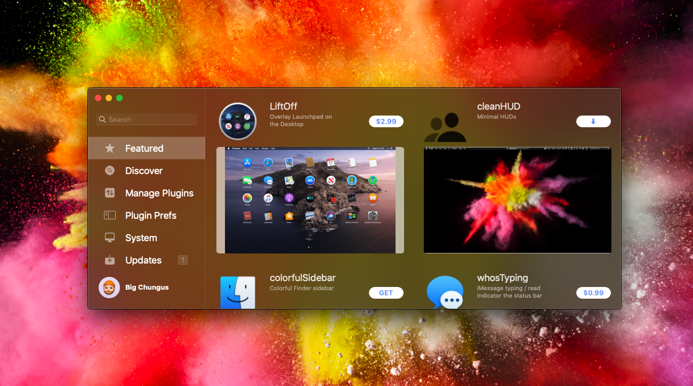

<!---->

MacPlus is an open-source plugin manager for macOS. It lets you discover, install and manage plugins to improve the user experience of macOS without the need for manually cloning/building or copying files.

## Installation

- Download the [latest release](https://github.com/w0lfschild/app_updates/raw/master/MacPlus/MacPlus_master.zip)
- Unzip the download if your browser does not do so automatically
- Open MacPlus
- MacPlus will ask to be moved to /Applications
- MacPlus may ask to install or update helper tools
- Start installing and using plugins

## Functionallity Note

- In order for plugins to load into system applications you may be required to disable [System Integrity Protection](https://apple.stackexchange.com/questions/208478/how-do-i-disable-system-integrity-protection-sip-aka-rootless-on-os-x-10-11), MacPlus will inform you but cannot automate this process
- In order for plugins to load into some applications you may be required to disable [Apple Mobile File Integrity](https://www.theiphonewiki.com/wiki/AppleMobileFileIntegrity)
- In order for plugins to load into some applications the plugin must be signed and in the `/Library` directory

## Requirements

- MacPlus supports macOS 10.10 and above
- plugins distributed through may have different application and system requirements

## Features

- Discover
    - See what are the best current plugins
    - Discover, download and update plugins

- Changes
    - Browse all existing plugins
    - Search for plugins (by name or ID)
    - Search individual repositories
    - Add or remove repositories
    - It's easy to host your own repository on GitHub

- Manage
    - Delete plugins (Trash can)
    - Show plugins in Finder (Eye icon)
    - Enable/Disable plugins (Check box)
    - Toggle plugins between single user and all users (User icon)
    - Search for plugins (by name or ID)
    - MacPlus automatically detect existing plugins located in 

- Install plugins simply
    - Drag and drop plugins onto MacPlus to automatically install them
    - MacPlus can open files with the `.bundle` extension to automatically install them

- Stay up to date
    - Show plugin updates in the updates tab
    - Option to automatically keep plugins up to date
    - Updates are shown as a badge on the MacUpdate icon

- Stay safe
    - Blacklist applications to avoid issues

- And much more...

## Creating a plugin

- Download and install `MacPlus`
- Open `MacPlus`
- Open `Xcode` and navigate `File` > `New` > `Project...`
- Search for `MacPlus Plugin`
- Select it and press `Next`
- Enter a  `Product Name` and target bundle id e.g. `com.apple.loginwindow` and press `Next`
- Select a location for your project and press `Create`
- Add your code
- You can find header dumps of most Apple Applications [HERE](https://github.com/w0lfschild/macOS_headers)
- Build your code
- Open your plugin with `MacPlus`

## Submitting a plugin

- Head over to the [MacPlus plugin repository](https://github.com/w0lfschild/macplugins)
- [Fork](https://github.com/w0lfschild/macplugins/fork) the project
- Add your compiled and zipped plugin to the bundles folder
- Edit packages_v2.plist to include your submission
- Submit a [pull request](https://github.com/w0lfschild/macplugins/compare)

## Troubleshooting

- Having problems? Submit an issue here: [submit](https://github.com/w0lfschild/MacPlus/issues/new)

## Uninstalling

- Trashing `MacPlus` will stop it from loading into applications 
- If you want a full clean select `Preferences` from the sidebar, then click `Uninstall MacPlus`. Log out and back in for changes to fully apply.

## Developement

- [Wolfgang Baird](https://github.com/w0lfschild) ([@w0lfschild](https://github.com/w0lfschild))
